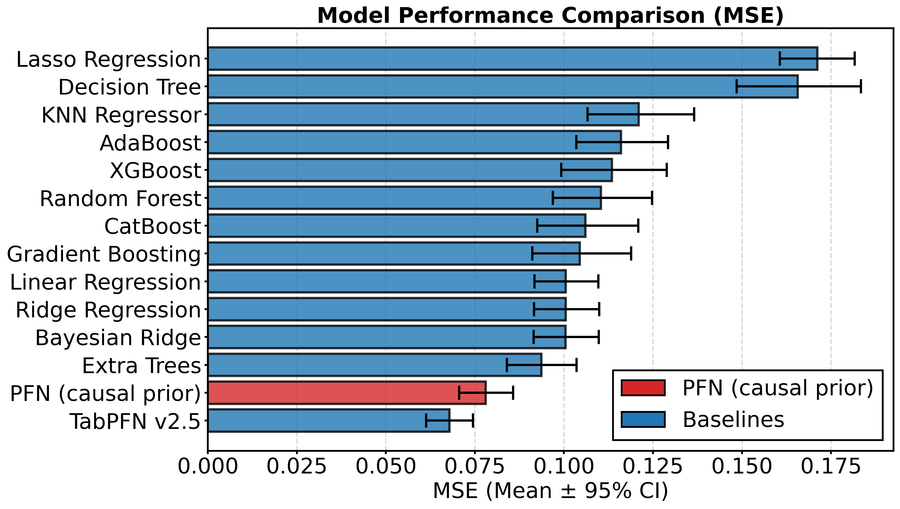

# Causal Foundation Models with Partial Graphs

This repository contains the code for training and evaluating causal foundation models that leverage partial graph knowledge for causal effect estimation.

---

## Table of Contents

- [Installation](#installation)
- [Quick Start](#quick-start)
- [Project Structure](#project-structure)
- [Experiments](#experiments)
- [Benchmarks](#benchmarks)

---

## Installation

```bash
# Clone the repository
git clone https://github.com/ArikReuter/Graphs4CausalFoundationModels.git
cd Graphs4CausalFoundationModels

# Install dependencies
pip install -r requirements.txt
```

---

## Quick Start

All experiments can be run using a unified interface:

```bash
python3 run.py --config "path/to/config.yaml"
```

---

## Project Structure

```
CausalPriorFitting/
├── src/                          # Source code
│   ├── models/                   # Model architectures
│   ├── priors/                   # Causal prior definitions
│   ├── priordata_processing/     # Data processing utilities
│   ├── training/                 # Training loops and utilities
│   ├── benchmarking/             # Evaluation and benchmarking
│   ├── Losses/                   # Loss functions
│   └── utils/                    # General utilities
├── experiments/                  # Experiment configurations
│   ├── GraphConditioning/        # Linear-Gaussian experiments
│   ├── complexmech/              # Complex mechanism experiments
│   └── Predictive/               # Predictive model experiments
├── RealCauseEval/                # Real-world causal evaluation
└── requirements.txt              # Python dependencies
```

---

## Prior

This repository contains the code for a natively causal prior that yields a tabular foundation model with competitive predictive performance on small datasets. 

This prior directly supports sampling of observational data, interventional data, as well as the corresponding SCM. 



On datasets up to 1000 samples, a predictive model trained on this prior achieves competitive performance with untuned tabular baselines. 

Please see the README in `src/prior` for more details on the prior.

## Model

### Checkpoints

Pre-trained model checkpoints are available in `experiments/checkpoints/`:

This includes (a) a model trained in the linear-Gaussian case (`lingaus/`) to predict $p(y \mid \text{do}(t), D)$, where $y$ is an outcome, $t$ a treatment, and $D$ an observational dataset, (b) a model to predict $p(y \mid \text{do}(t), D)$ trained on complex mechanisms (`model/`), as well as (c) a model to predict the conditional interventional distribution $p(y \mid \text{do}(t), x, D)$ (`full_conditioned_model/`).

### Inference with the Sklearn-like Wrapper

The `GraphConditionedInterventionalPFNSklearn` wrapper provides a simple interface for inference:

```python
from src.models.GraphConditionedInterventionalPFN_sklearn import GraphConditionedInterventionalPFNSklearn

# Load model
wrapper = GraphConditionedInterventionalPFNSklearn(
    config_path="experiments/checkpoints/full_conditioned_model/config.yaml",
    checkpoint_path="experiments/checkpoints/full_conditioned_model/model.pt",
)
wrapper.load()

# Predict interventional outcomes
# adjacency_matrix shape: (L+2, L+2) with ordering [T, Y, X_0, ..., X_{L-1}]
# A[i,j] = 1 means directed edge i → j
preds = wrapper.predict(
    X_obs, T_obs, Y_obs,     # Observational data
    X_intv, T_intv,           # Interventional query
    adjacency_matrix,         # Causal graph structure
    prediction_type="mean",   # "mode", "mean", or "sample"
)

# Compute log-likelihood of interventional outcomes
log_probs = wrapper.predict_log_likelihood(
    X_obs, T_obs, Y_obs,
    X_intv, T_intv, Y_intv,
    adjacency_matrix,
)
```

The wrapper auto-detects the model architecture from the config and automatically selects GPU if available. See the docstring of `GraphConditionedInterventionalPFNSklearn` for the full adjacency matrix format specification.

## Experiments

### Linear-Gaussian Experiments

Experiments on linear-Gaussian structural causal models with varying graph knowledge:

| Experiment | Config Directory |
|------------|------------------|
| 50-node graphs | `experiments/GraphConditioning/configs_50node` |
| 50-node with ancestor info | `experiments/GraphConditioning/configs_50node_ancestor` |
| 50-node with IDK (partial knowledge) | `experiments/GraphConditioning/configs_50node_idk` |

**Example:**
```bash
python3 run.py --config experiments/GraphConditioning/configs_50node/your_config.yaml
```

### Complex Mechanism Experiments

Experiments with non-linear causal mechanisms:

```bash
python3 run.py --config experiments/complexmech/configs/your_config.yaml
```

### Predictive Model

Train and evaluate a predictive model:

```bash
python3 run.py --config experiments/Predictive/configs/predictive.yaml
```

---

## Benchmarks

The repository includes three benchmarks for evaluating causal inference models, located in `experiments/GraphConditioning/Benchmarks/`:

| Benchmark | Description | Mechanisms | Edge States |
|-----------|-------------|------------|-------------|
| [LinGaus](experiments/GraphConditioning/Benchmarks/LinGaus/) | Full graph knowledge | Linear | {0, 1} |
| [ComplexMechIDK](experiments/GraphConditioning/Benchmarks/ComplexMechIDK/) | Partial graph knowledge | MLP/XGBoost | {-1, 0, 1} |
| [ComplexMech](experiments/GraphConditioning/Benchmarks/ComplexMech/) | Sample size experiments | MLP/XGBoost | {0, 1} |

See the README in each benchmark directory for detailed usage instructions.

---